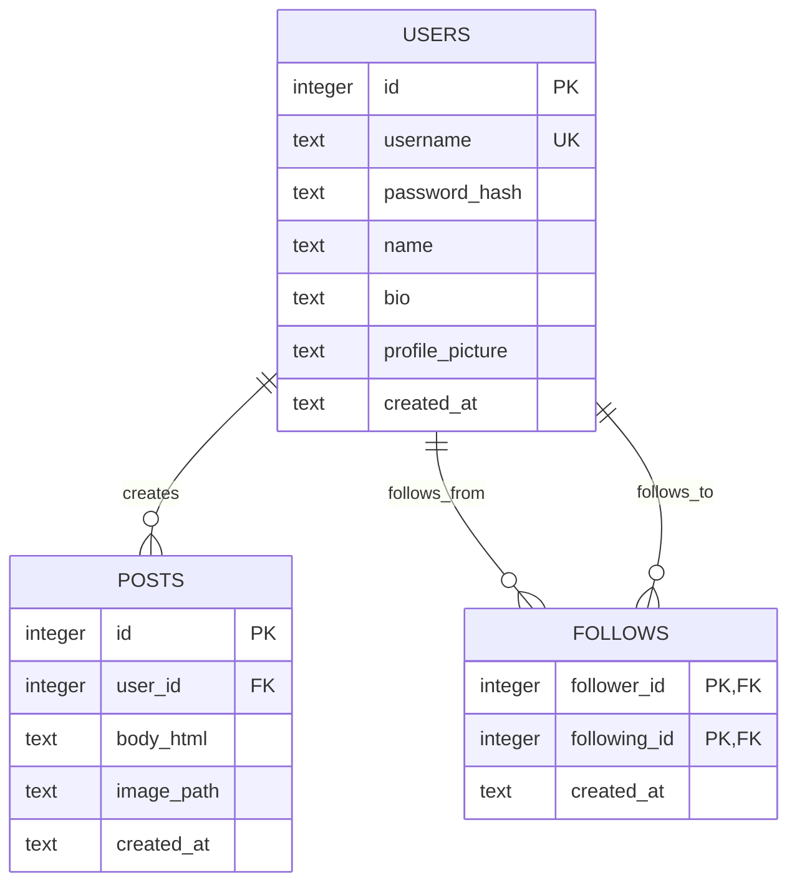

# InstaRUNI

A local Instagram-like full-stack course project built with a React frontend and Node.js backend. It includes authentication, profiles, follows, rich text posts, image uploads, global/following feeds, and lazy loading.

## Run locally

```bash
npm install
npm run seed
npm run build
npm start
```

Open `http://localhost:3000`.

For frontend development, run `npm start` in one terminal for the Node API and `npm run dev` in another terminal for the React/Vite app.

The SQLite database is created at `data/socialite.db`. Uploaded images are saved in `public/uploads`.

`npm run seed` resets the local database and fills it with fake users from RandomUser, fake post text from DummyJSON, Picsum post images, and demo follow relationships. Every fake user has the password `password123`.

## Features checklist

- Sign-up, login, logout
- Password hashing with `bcryptjs`
- React frontend served by Node.js
- User profile pages with name, bio, profile image, posts, follower count, and following count
- Edit profile page for changing name, bio, and profile picture
- Profile post display controls for list/grid mode
- Username search
- Explore page for discovering fake/demo users
- Follow and unfollow
- Post timestamps displayed as "time ago"
- Global feed and following feed
- Feed display controls for list/grid mode
- Feed filters by author name, post type, and date range
- Feed date sorting by newest or oldest
- Infinite scroll / lazy loading
- Text and image post creation
- WYSIWYG editor buttons for bold, italics, and hyperlinks
- SQL schema diagram included below

## Database diagram


